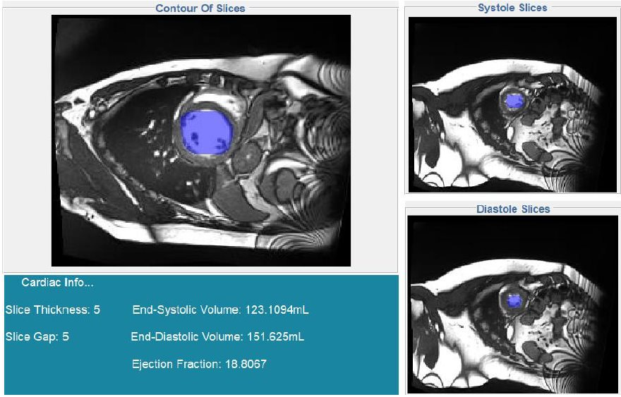

# LV-segmentation-MRI

## Overview

This project addresses the **Automatic Cardiac Diagnostic Challenge (ACDC)**, focusing on **left ventricle (LV) segmentation** in MRI images. The tool integrates two fully automatic segmentation methods: **K-means clustering** and **deep learning (Mask R-CNN)**, unified in a **Python + MATLAB GUI** for ease of use.

Key features:
- Automatic segmentation of the **left ventricle endocardium** during **diastole** and **systole**.
- Calculation of **ventricle cavity volumes** (End-Diastolic, End-Systolic) and **Ejection Fraction**.
- GUI interface allowing users to switch between segmentation methods and visualize results.
- Deep learning pipeline built on **TensorFlow**, with dataset creation, training, and validation integrated into the GUI.
- Tested on a database of **100 patients**, achieving significant precision for both methods.

---

## Folder Structure

